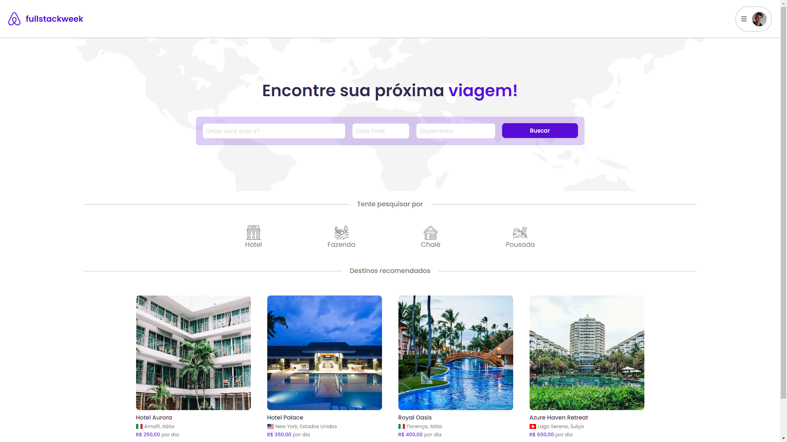

<h1 align="center"> FSW Trips </h1>

<p align="center">
✅ This Full-Stack project is aimed at providing a user-friendly platform for planning and managing travel itineraries. The project focuses on creating a streamlined experience for users, making it easy to organize their trips and access all the necessary information.
</p>

<p align="center">
  <a href="#technologies">Technologies</a>&nbsp;&nbsp;&nbsp;|&nbsp;&nbsp;&nbsp;
  <a href="#learning">What I've Learned</a>&nbsp;&nbsp;&nbsp;|&nbsp;&nbsp;&nbsp;
  <a href="#installation">Installation</a>&nbsp;&nbsp;&nbsp;|&nbsp;&nbsp;&nbsp;
  <a href="#contribution">Contribution</a>&nbsp;&nbsp;&nbsp;|&nbsp;&nbsp;&nbsp;
  <a href="#layout">Layout</a>&nbsp;&nbsp;&nbsp;&nbsp;&nbsp;&nbsp;
</p>

<br>

<p align="center">
  
</p>
<h1 id='technologies'>🖱️ Technologies</h2>

<p>This project was made with the following technologies/libraries:</p>

- Typescript
- Next.js
- Prisma
- PostgreSQL
- Tailwind CSS
- Stripe (fake payment)
- NextAuth
- Date-fns
- React-icons
- React Toastify (pop-ups)

<br />

<h1 id='learning'>🧠 What I've Learned</h2>

<p>In this website, I worked with:</p>

- Server Routes with Next.js
- NextAuth + OAuth implementation
- Basic utilization of Stripe
- Better knowledge with Tailwind CSS
- "Providers" utilization

<br />

<h1 id='layout'>🖥️ Layout</h1>

<br />

> To see the Figma of the project, use [THIS LINK](https://www.figma.com/file/gWRHt9TxdTLQxo5Np7yAaq/FSW-Project-%5BLive%5D?type=design&node-id=194-1733&mode=design&t=jAZ7npHf4QWcqZwJ-0)

<br />

<h1 id='installation'>📤 Installation</h1>

<h3>Firstly, you need to <strong>clone the project</strong> on your machine:</h3>
<br />

```bash
git clone https://github.com/cristian-sbardelotto/fsw-trips
```

<br />

<h3>After that, open the project folder and <strong>install the dependencies:</strong></h3>

<br />

```bash
npm i
# or
yarn
```

<h3>

Create an `.env` file and populate it as the [.env.example file](./.env.example).

</strong></h3>

<h3>To <strong>run the project</strong> on your browser, use:</h3>

```bash
npm run dev
# or
yarn dev
```

<br/>

<h1 id='contribution'>🤝 Contribution</h1>

<br />

**1.** Fork the `cristian-sbardelotto/fsw-trips` repository on GitHub.

**2.** Create a new branch for your changes.

**3.** Make the desired changes and commit.

**4.** Submit a pull request with your chang1es.

<br />

---

<div align='center'>

<h2 align='center'>Enjoy this project!</h2>

<br />

Developed with ❤️ by <strong>Cristian Sbardelotto</strong>

<br />

[](https://www.linkedin.com/in/cristian-k-sbardelotto/)
[](https://github.com/cristian-sbardelotto)

[Portfolio](https://bit.ly/portfolioSbardelotto)

</div>
